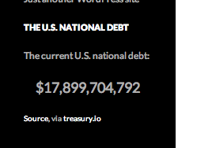
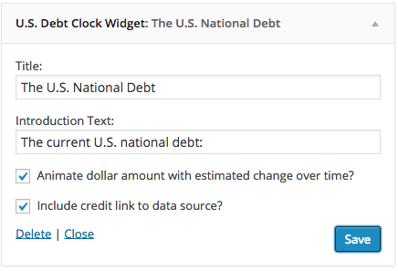

# U.S. Debt Clock Widget

> Creates a widget displaying the most recently available amount of the U.S. National Debt.

    

## Description

This plugin creates a widget displaying the most recently available amount of the U.S. National Debt. Data is retrieved from treasurydirect.gov and a source link can optionally be displayed.

### Front end widget display

### Admin widget configuration

## Requirements

* [WordPress](http://wordpress.org) 2.8+

## Installation

U.S. Debt Clock Widget is most easily installed automatically via the Plugins tab in your dashboard.

## Support Level

**Active:** I actively maintain this project, and expect to continue work for the foreseeable future including keeping tested up to the most recent version of WordPress.  Bug reports, feature requests, questions, and pull requests are welcome.

## Contributing

Pull requests and issues on [GitHub](https://github.com/ChrisHardie/us-debt-clock-widget) are welcome.